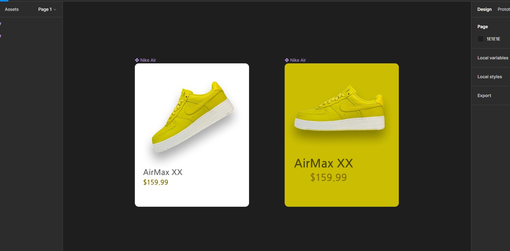

## Hi My name is Abhishek Gaur 👋🙌

### A Web Developer | Student at Humber College | Sports and Reading | My motivation is to see what is impossible and to move my work gauge to make it possible.

#### You can connect me through:
1. Linkedin : [click here](https://www.linkedin.com/in/abhishek-gaur-316a88252/)
2. Instagram ID : iamgaurabhishek

**iamgaurabhishek/iamgaurabhishek** is a ✨ _special_ ✨ repository because its `README.md` (this file) appears on your GitHub profile.

#### You can connect me through:
1. Linkedin : [click here](https://www.linkedin.com/in/abhishek-gaur-316a88252/)

Here are some ideas to get you started:

- 🔭 I’m currently working on React.js, express.js and Redux.js
- 🌱 I’m currently learning JWT
- 👯 I’m looking to collaborate on React.js
- 🤔 I’m looking for help with Co-op
- 💬 Ask me about JS, React
- 📫 How to reach me: abhishekgaur1996@gmail.com  
- 😄 Pronouns: He/ him
- ⚡ Fun fact: Love reading and watching movies.

